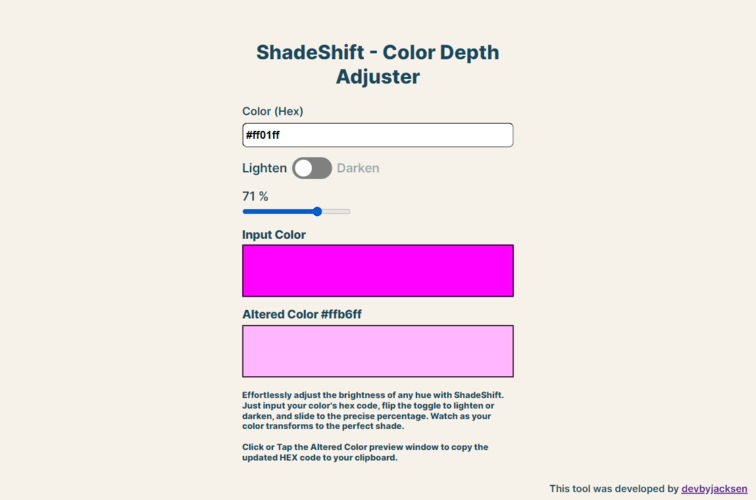

# ShadeShift - Color Depth Adjuster

## Introduction

Welcome to Shadeshifter, a handy web tool designed for developers, designers, and color enthusiasts. Born from a passion for building practical tools for real-world applications, Shadeshifter allows users to easily manipulate color hues to their desired intensity. Whether you're looking to lighten or darken a color for your web project, Shadeshifter offers a simple and intuitive solution.

## Motivation

My motivation for creating ShadeShift stems from a personal need for a tool that can quickly adjust color shades for web development projects. As a developer, I often find myself needing to tweak color hues, and Shadeshifter provides a perfect solution. Moreover, this project has been a valuable opportunity to hone my skills in HTML, CSS, and JavaScript.

## Future Enhancements

Looking ahead, I plan to expand ShadeShift with more features and possibly integrate it into a larger suite of developer tools. Stay tuned for more updates and feel free to contribute your ideas and feedback!

## Acknowledgements

ShadeShift was inspired by a tutorial on Scrimba, but it has grown with unique features and personal touches that make it more than just a tutorial project.
A few of the improvements include:

1. The addition of meta tags for seo puposes
2. The addition of meta:og tags and image for social sharing
3. Improved layout and styling
4. Additional functionality of allowing the altered hex code to be copied on a click or tap event
5. Notification that appears for 2.5 seconds to alert user of a successful copy to clipboard event
6. Custom cursor hover icon on desktop for hover of altered color preview & anchor tag / link to my personal portfolio website.

